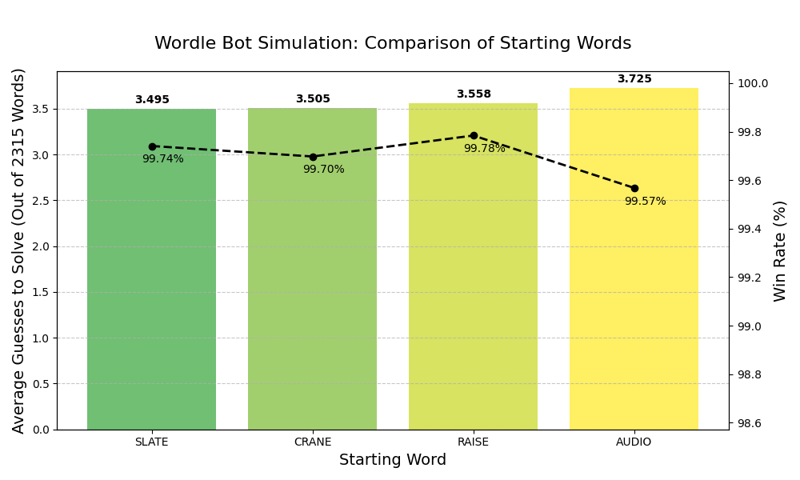

# **Wordle Bot: Entropy-Based Solver & Simulations**

This project provides a Wordle-solving engine that uses **Information Entropy** to minimize uncertainty and find the hidden word in the fewest guesses possible. It includes a CLI bot for live play and a simulation suite to benchmark performance across the entire Wordle dictionary.

## **Core Logic: How it Works**

The bot uses Claude Shannon’s Information Theory to rank guesses. For every possible word in the dictionary, it calculates the **Expected Information (Entropy)** in bits:

$$E[I] = \sum_{i=1}^{n} P(x_i) \log_2\left(\frac{1}{P(x_i)}\right)$$

The bot evaluates how each potential guess splits the remaining word pool into different feedback patterns (Green/Yellow/Black). It then chooses the word that, on average, provides the most "bits" of information to prune the list of candidates most aggressively.

## **1\. Wordle Bot (Live Play)**

Use the bot to help you solve the daily Wordle by providing it with real-time feedback.

### **How to Run**

python wordle\_bot.py

### **Usage**

1. Enter the suggested starting word (default: **RAISE**).  
2. Input the feedback you get from Wordle using these codes:  
   * **G**: Green (Correct Letter, Correct Position)  
   * **Y**: Yellow (Correct Letter, Wrong Position)  
   * **B**: Black/Gray (Wrong Letter)

*Example: If your guess is RAISE and the feedback is YBGBG, type YBGBG into the prompt.*

## **2\. Simulations & Benchmarking**

The project includes a suite to test the bot's efficiency across all \~2,315 possible Wordle answers.

* **simulation.py**: Runs a full-scale simulation using a fixed starting word (default: *Raise*).  
* **start\_word\_simulation.py**: Compares the effectiveness of multiple starting words (*Slate*, *Crane*, *Raise*, *Audio*).

### **Simulation Performance**

Based on the results in start\_word\_summary.csv, the bot achieves a near-perfect win rate:

| Starting Word | Mean Guesses | Win Rate (%) | Total Games |
| :---- | :---- | :---- | :---- |
| **SLATE** | 3.49 | 99.74% | 2315 |
| **CRANE** | 3.50 | 99.70% | 2315 |
| **RAISE** | 3.56 | 99.78% | 2315 |
| **AUDIO** | 3.72 | 99.57% | 2315 |

## **3\. Data Visualization & Effectiveness Analysis**

You can visualize the relationship between predicted entropy and actual word list reduction using the provided plotting scripts.

### **Generate Visuals**

python visualize\_data.py  
python start\_word\_visualize\_data.py

### **Entropy Score vs. Actual Word Reduction**

The third plot in simulation\_results.png analyzes the predictive power of the entropy engine. By plotting the **Calculated Entropy (Bits)** against the **Actual Word Reduction (Words Eliminated)**, we can measure the bot's "effectiveness."

* **Theoretical vs. Empirical**: Each "bit" of entropy theoretically represents a doubling of the bot's certainty (halving the word pool). A score of 5 bits suggests the pool should shrink by a factor of $2^5$ (32x).  
* **Correlation (**$R^2$ **Score)**: The visualization typically shows a high $R^2$ value (often above 0.85). This indicates a strong linear correlation, proving that the entropy calculation is a highly reliable predictor of how many words will actually be eliminated by a specific guess.  
* **Performance Insight**: Outliers in this graph (where high entropy results in low reduction) typically occur in "word traps" (e.g., words ending in *\-IGHT*), where the bot must prioritize narrowing down specific letters over general information gain.

### **Key Insights**

* **Efficiency**: The majority of games are solved in 3 or 4 guesses, with very few requiring all 6 attempts.  
* **Optimal Openers**: Words with high vowel and common consonant counts (like *SLATE* or *RAISE*) consistently yield higher initial entropy scores, leading to lower mean guess counts.

## **File Structure**

* wordle\_bot.py: The main engine and CLI.  
* simulation.py: Parallelized simulation runner for benchmarking.  
* start\_word\_simulation.py: Comparative analysis of different openers.  
* visualize\_data.py: Matplotlib scripts to visualize simulation results.  
* possible\_answers.txt: The dictionary of valid Wordle solutions.  
* csv/: Raw data outputs including simulation\_data.csv and start\_word\_summary.csv.  
* images/: Generated plots like simulation\_results.png and start\_word\_comparison.png.

## **License**

This code is free to use for educational and personal purposes. User takes full responsibility and uses at their own risk.